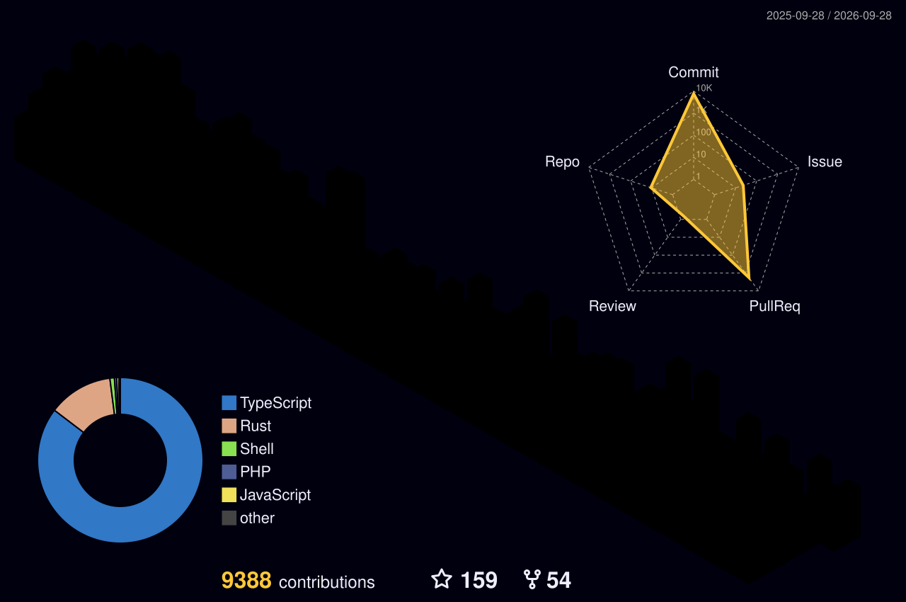

## Vincent Vu

**Founder & CEO, [Rubix Studios](https://rubixstudios.com.au)** · Melbourne, Australia

I build software, digital products, and brands. My work spans web and desktop applications, content platforms, infrastructure, and the creative work that supports a product’s launch and growth.

I lead **Rubix Studios**, an agency working across software development, branding, media, and marketing. I also founded **[Rubix Host](https://rubixhost.com.au)** and am building **[Onedash](https://onedash.au)**, a desktop workspace for apps, accounts, notes, and tasks.

### Ventures

- **[Onedash](https://onedash.au)** · A workspace for every app and account
- **[Rubix Studios](https://rubixstudios.com.au)** · Software, branding, media, and marketing
- **[Rubix Host](https://rubixhost.com.au)** · Australian web and email hosting

### Technologies

